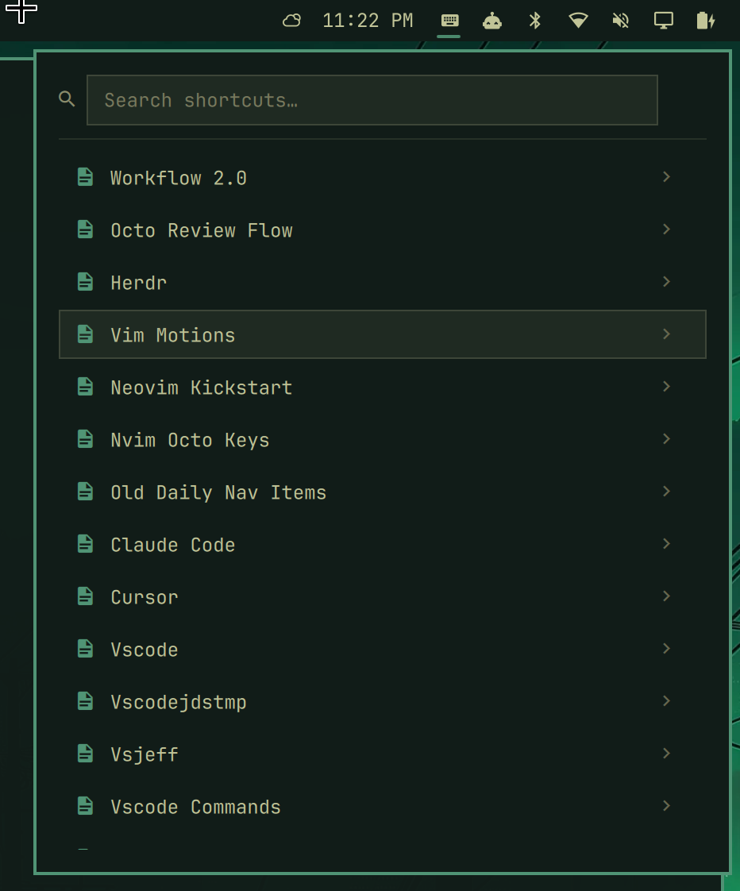
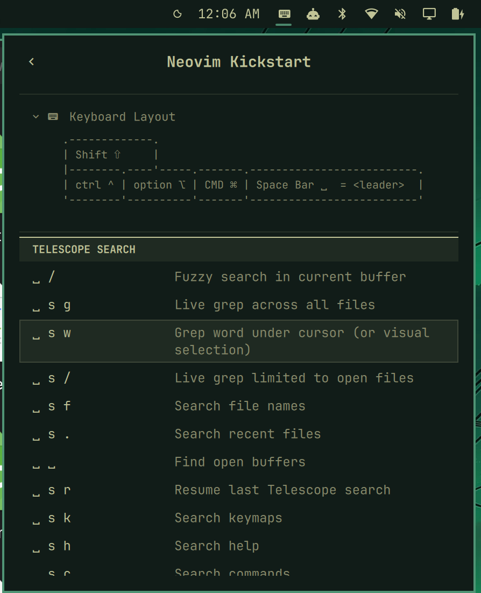

# ThockRef for Omarchy

Your own keyboard-shortcut cheat sheets for any app, written in Markdown, searchable from the Omarchy bar.

ThockRef adds a keyboard icon to the bar. Click it (or press a hotkey) to get a searchable list of shortcut "libraries": one Markdown file per app, tool, or workflow. Type to search every shortcut in every library at once, or open a library to browse its sections, its optional keyboard-layout legend, and its links.




It is the Linux counterpart of the [ThockRef macOS menu-bar app](https://github.com/jsheffie/ThockRef). Both read the same files from the same directory, so a set of cheat sheets works on either machine.

## Install

```sh
omarchy plugin add https://github.com/jsheffie/omarchy-thockref.git --enable
```

The widget lands in the right section of the bar. Move it with:

```sh
omarchy bar move io.github.jsheffie.thockref --section center
```

### Hotkey

Plugins cannot install keybindings, so add one yourself in `~/.config/hypr/bindings.lua`. Omarchy already uses `Super + K`, `Super + Ctrl + K`, and `Super + Alt + K` for its own keybinding viewers, so this one fits next to them:

```lua
o.bind("SUPER + SHIFT + K", "ThockRef", "omarchy-shell shell toggle io.github.jsheffie.thockref")
```

## Usage

The panel opens with the search field focused.

| Key | In the library list or results | In a library |
|---|---|---|
| Type | Filter every shortcut across all libraries | |
| `↓` `↑` | Move the cursor | Move the cursor (`j` `k` also work) |
| `Enter` | Open the library under the cursor | Open the link under the cursor, or toggle the legend when nothing is selected |
| `Esc` | Clear the query, then close | Back to the list |
| `h` or `←` | | Back to the list |
| `L` | | Toggle the keyboard-layout legend |
| `r` | | Re-read the data directory |
| `Tab` | Switch to the neighbouring bar panel | Switch to the neighbouring bar panel |

Middle-click the bar icon to re-read the data directory. Search understands modifier words, so `cmd p`, `ctrl c`, and `opt` match `⌘ p`, `^ c`, and `⌥`.

## Adding your own libraries

Libraries are Markdown files in `~/.config/thockref/` (or `$XDG_CONFIG_HOME/thockref/`). The directory is created the first time the panel opens. Files are listed in filename order; a `NNN-` prefix (`001-vim-motions.md`) controls the order and is stripped from the display name, and hyphens become spaces (`nvim-octo-keys.md` shows as "Nvim Octo Keys").

A library is any Markdown file with two-column pipe tables:

```markdown
# Ghostty Keyboard Shortcuts

- [Ghostty docs](https://ghostty.org/docs)

## Tabs

| Key Seq | Result      |
|---------|-------------|
| ⌘ t     | New tab     |
| `Ctrl` -> `Tab` | Next tab |
```

- `## Heading` lines become section headers.
- The first non-empty cell of each row is the key sequence, the next non-empty cell is the description. Extra columns are ignored, so a blank "reverse binding" column works.
- Backticks are stripped and ` -> ` becomes `→`.
- A fenced block that starts with ```` ```laptop-layout ```` becomes a collapsible legend, handy for ASCII keyboard art.
- `[label](https://...)` links outside tables are collected into a Links section.

See [thockref-keybind-template.md](thockref-keybind-template.md) for every supported form.

### Example libraries

The `examples/` folder has twenty ready-made libraries (Vim motions, Neovim, Ghostty, VS Code, Cursor, Claude Code, Chrome, Herdr, and more). Install the ones you don't have yet:

```sh
cd ~/.config/omarchy/plugins/io.github.jsheffie.thockref
make seed      # copies examples that are not already installed
make dist      # replaces ~/.config/thockref/*.md with the examples
```

The order comes from `examples/thockref-files-order`.

## Update and remove

```sh
omarchy plugin update io.github.jsheffie.thockref
omarchy plugin remove io.github.jsheffie.thockref
```

Removing the plugin leaves `~/.config/thockref/` untouched.

## Dependencies and permissions

- `bash` and `jq` (both ship with Omarchy) to list the data directory.
- `xdg-open` to open links from a library.
- No sudo, no installers, no services, no network access. The plugin only reads `~/.config/thockref/` and, like every Omarchy plugin, runs unsandboxed inside `omarchy-shell`.

## Development

Check out this repository, then from its directory:

```sh
make test        # node tests for the parser and search
make link        # validate, then symlink this checkout into ~/.config/omarchy/plugins
make enable      # put the widget on the bar
make reload      # after editing QML: restarts omarchy-shell, since a rescan keeps the compiled widget
make unlink      # remove the symlink
```

`ThockRefModel.js` is a line-for-line port of the macOS app's parser and search, kept in ES5 so it runs both in Quickshell's QML engine and in Node. If you change the file format, change it in both projects.

## License

[MIT](LICENSE)
